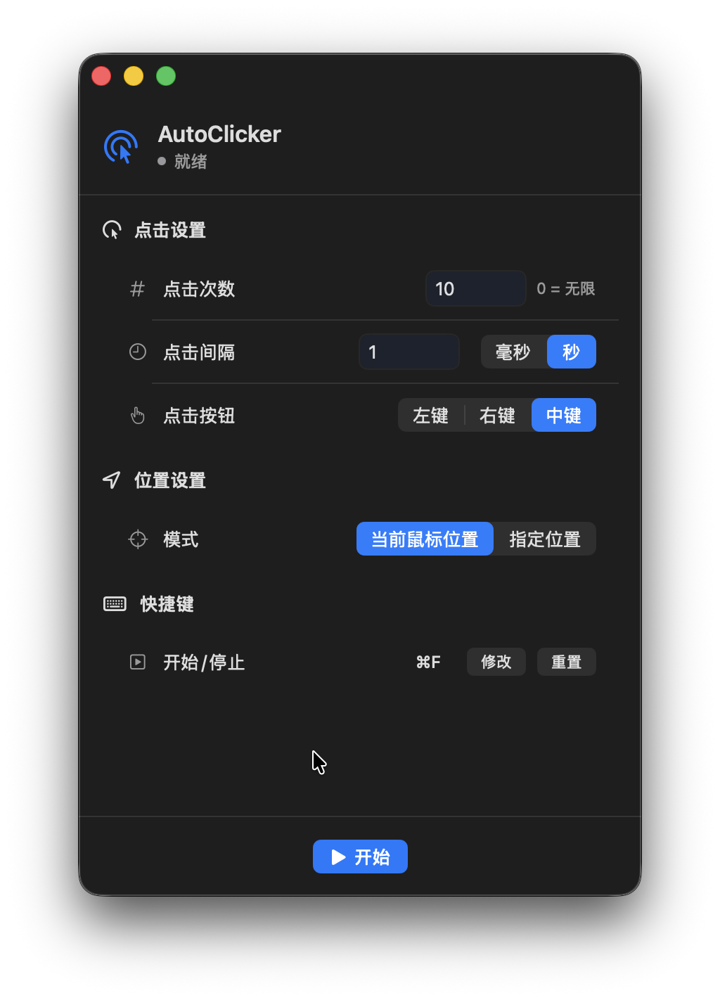

# AutoClicker

A macOS native auto-clicker application.

## Screenshot



## Features

- **Auto-clicker** - Configure click count and interval
- **Multiple click modes** - Left, right, and middle mouse button support
- **Position selection** - Use current mouse position or specify fixed coordinates
- **Global hotkey** - Customizable start/stop hotkey
- **Native UI** - Clean macOS native interface design

## System Requirements

- macOS 15.0 (Sequoia) or later

## Usage

1. On first launch, grant Accessibility permission (System Settings > Privacy & Security > Accessibility)
2. Set click count (0 for unlimited)
3. Set click interval (milliseconds or seconds)
4. Choose click button and position mode
5. Click "Start Auto Click" or use the hotkey to start/stop

## Hotkey

- Default: ⌘F9 (Start/Stop)
- Customizable in settings

## Build

```bash
cd AutoClicker
xcodegen generate
open AutoClicker.xcodeproj
```

## License

MIT License
